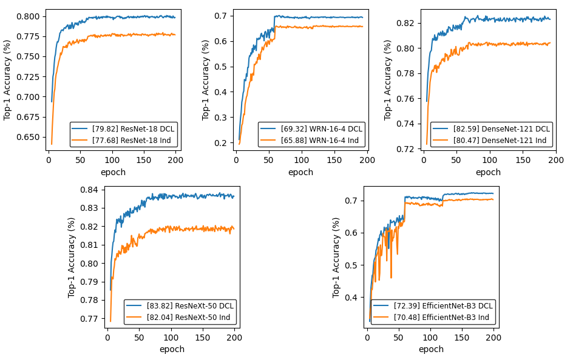
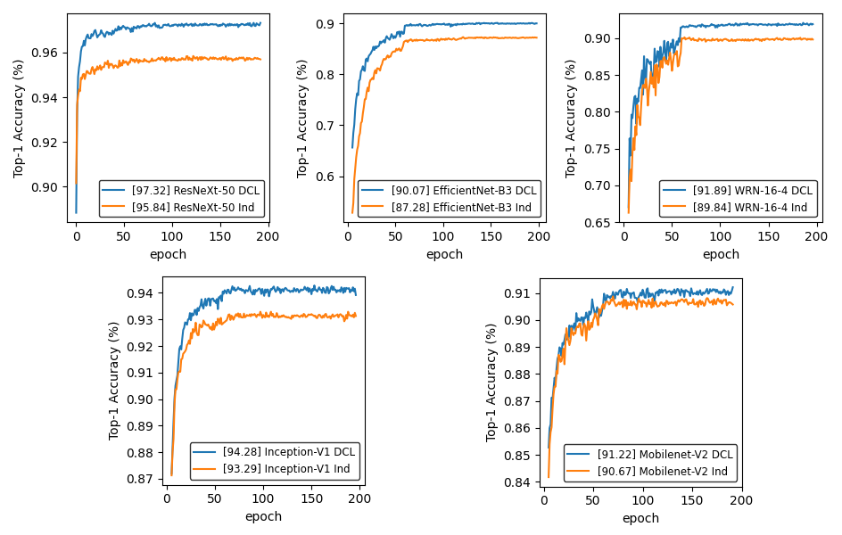
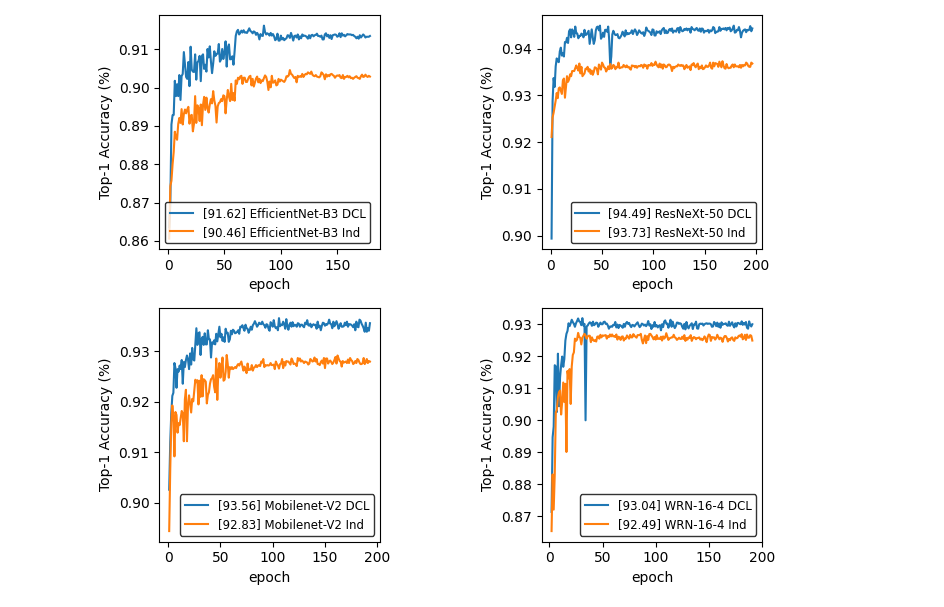
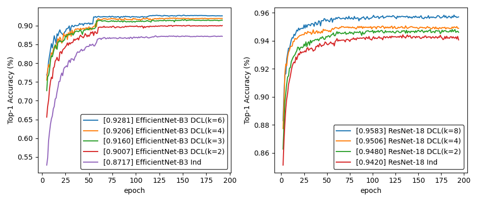

# Deep-Communication-Learning
## Introduction
We propose a Deep Communication Learning (DCL) strategy to address the problem of how to make 
deep neural networks learn faster and more adequately by allowing multiple deep neural networks to communicate 
network parameters as knowledge during the learning process, which results in a better learning result. Experimental 
results on multiple datasets show that different types of networks learn more efficiently and adequately with DCL, 
and the network performance is significantly improved.

## Requirements

- python 3.8
- pytorch 1.7.8 + cuda 10.2

## Usage

### Data Preparation
The dataset files will be automatically downloaded and saved in [data](data) folder during 
training of the neural networks.


### Training and testing
You will need to specify the network and dataset you want to train and test by manually modifying the 
[config.ini](config.ini).


example:
1. Train DenseNet-121 with DCL on dataset CIFAR-100  
    The contents of the [config.ini](config.ini) file are as follows:
    ```
    [train]
    ;optional: CIFAR-10, CIFAR-100, Fashion-MNIST
    dataset = CIFAR-100
    gpu_id = 0
    seed = 1024
    num_networks = 2
    ;optional: ResNet-18, WRN-16-4, Inception-V1, DenseNet-121, ResNeXt-50, EfficientNet-B3, MobileNet-V2
    nn_type = DenseNet-121
    pre_trained = True
    is_communicate = True
    beta = 0.1
    individually_train_batch_size = 10
    epochs = 200
    lr_init = 0.001
    batch_size = 5
    weight_decay = 5e-4
    ;optional: Adam, SGD
    optimizer = SGD
    
    ```
    Then Execute the command line code:
    ```
    $ python train.py
    ```

2. Train DenseNet-121 with DCL on dataset CIFAR-100  
    The steps are almost the same as above, except that you need to change 
    `is_communicate = True` to `is_communicate = False`.  
The logs of the program runs will be saved in the [logs](logs) folder.

## Result

1. Results obtained on three datasets when experiments are performed using two neural networks.

    **Results on CIFAR-100 when K=2:**
    
    

    **Results on CIFAR-10 when K=2:**
    
    

    **Results on Fashion - MNIST when K=2:**
    
    

2. Results obtained when experiments are performed using different numbers of neural networks.

    **Results on CIFAR-10:**
    
    